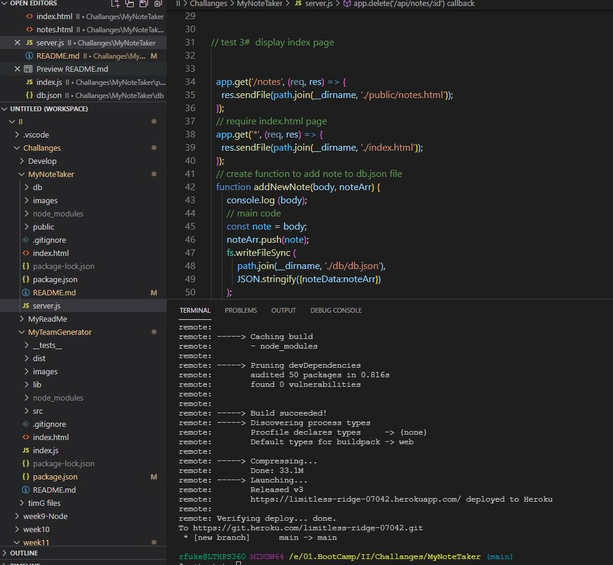

# Note Taker
  My Note Taker
  ## Badge 

  ## Description 
 For week 11, challenge is to build application called Note Taker that can be used to write and save notes. This application will use an Express.js back end and will save and retrieve note data from a JSON file.
  
  ## Table of Contents
  *  [Installation](#installation)
  *  [Usage](#usage)
  *  [Credits](#credits)
  *  [License](#license)
  ## Installation 
 Create a .gitignore file, that include node_modules and .DS_Store/
 install express,js by typing in terminal " npm i express.js "
  ## Usage 
 run "npm start" to start express.js server, go to : http://localhost:3002/
 or run same app from https://limitless-ridge-07042.herokuapp.com/notes
  ## Credits 
 Robert Fuke
  ## License 
  https://choosealicense.com/licenses/express.js/

  ## Test 
 type in terminal "node start"
  ## Questions
  ### GitHub 
 link to my GitHub profile 
 https://github.com/LakiCode
  ### Contact 
 For any additional questions, please contact me over a Email. 
 My email address is: 
 rfuke@loffacorp.com
## App screenshots

### Application Link 
<a href="https://limitless-ridge-07042.herokuapp.com/" target="_blank">My Team Note</a>
